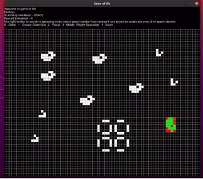

# Conway's game of life
This application has been made as a project for C++ course on AGH 2020/2021.

More about Game of Life can be found below:  
https://en.wikipedia.org/wiki/Conway%27s_Game_of_Life

Features list:
* Running simulation
* Stopping/ Restarting simulation
* Creating and destroying custom objects (by clicking cells)
* Spawning objects from file _patterns.txt_ as well as rotating them

### Author  
Michał Szczurek 